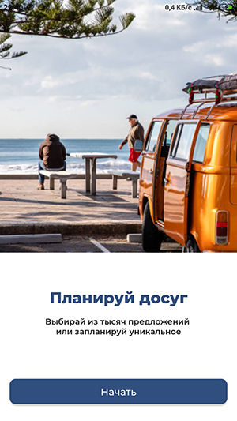
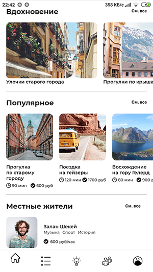
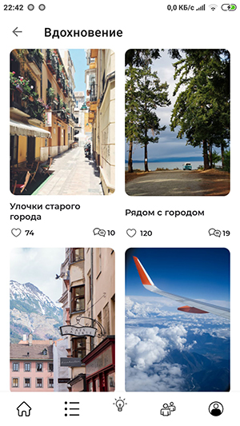
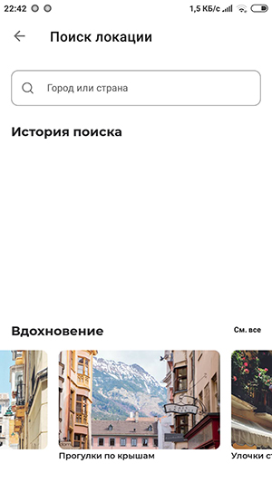
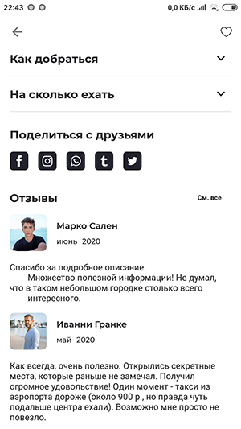

Приложение для путешественников, которое помогает найти местных жителей для погружения в культуру, изучения языка, посещения интересных мест во время поездки, поиска необходимых товаров и услуг.Приложение для путешественников, которое помогает найти местных жителей для погружения в культуру, изучения языка, посещения интересных мест во время поездки, поиска необходимых товаров и услуг.

---

##### Видео-презентация проекта:
https://www.youtube.com/watch?v=zoF770_r7y8&feature=emb_title

---
##### Цель: MVP – Minimal Viable Product
---
##### Основные программные решения:
- minSdkVersion 21
- Язык прогрммирования - *Kotlin*
- Архитектура - *MVVM*
- Single activity
- Элементы декларативного программирования для упрощенной работы со списковыми элементами
- Работа с потоками данных  - *Coroutines flow, channels*
- Использование библиотек:
  + Koin - внедрение зависимостей
  + Coroutines - асинхронное выполнение операций
  + Jetpack Paging3 - постраничная загрузка данных
  + Retrofit2, Gson - работа с веб-сервером
  + Coil - работа с изображениями
  + и другие

---

##### Выполненные задачи:
- Определены стили и элементы интерфейса
- Разработаны макеты основных экранов с загрузкой данных
- Реализована упрощенная аутентификация пользователя с запросом на веб-сервер
- Реализована навигация
- Реализованы элементы декларативного программирования для упрощенной работы со списковыми элементами
- Реализована загрузка данных с веб-сервера как в статичном режиме (список целиком), так и с пагинацией
- Реализована обработка ошибок загрузки данных
- Частично выполнено тестирование
---
##### В работе:
- Регистрация нового пользователя
- Аутентификация
- Разработка макетов недостающих экранов с загрузкой и отправкой данных на веб-сервер
- Тестирование
---
##### В планах:
- Кэширование загрузки данных

---
##### Команда андроид-разработки:
- **Тимлид** Алексей Логинов (https://github.com/Loginovalexey/)
- Андрей Созонов (https://github.com/AndrewSozonov)
- Дмитрий Бабанов (https://github.com/Dmitry108)
- Михаил Евтеев (https://github.com/MikhailEA)
- Александр Казирицкий (https://github.com/Kozirfm)

---
##### Описание базовы классов, руководство и примеры использования
https://docs.google.com/document/d/1e3mvtzVkgAuRIvOcoDDe_6GTddnBQuQgMN1BvfRJm24/edit?usp=sharing

UML-диаграмма наследования. Включены 2 конечных класса:AdvertsScreenFragment и LocalsLinearFragment
https://github.com/Loginovalexey/app_android/blob/development/schema.png

---
##### Скриншоты

---

---

---

---

---

---

---

